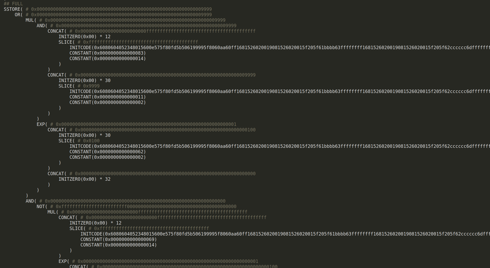

# TracEVM

This tool is used to track the values and addresses of slots (storage variables in Solidity) inside the Ethereum contract, as well as tracking logs (Solidity events).

- Partial symbolic execution provides the complete data on how a specific variable or slot address was calculated
- Suitable for learning about Solidity internals
- Written in Go and Python

## Building

Python and Flask are required to run the web view.

```bash
pip3 install Flask
```

Additionally, [Geth prerequisites](https://geth.ethereum.org/docs/getting-started/installing-geth#build-from-source) are required to compile Geth.

Finally, it is possible to build TracEVM.

```bash
./build.py
```

## Running

To open webview on address [127.0.0.1:4334](http://127.0.0.1:4334) run the following command.

```bash
./run.py conf.json
```

TracEVM will be running!


## Connecting with Remix

It is expected to have Remix installed.

Choose External HTTP Provider


Connect by default address.


## Usage example

Let's imagine we have such contract.


Let's deploy the contract and see the output.


We see that:

- event type is final_slot, which means that this slot was written at the end of transaction (not reverted).
- further we see slot offsets (constant - initial slot, mapping - solidity keccak mapping magic, offset - offset from last value)
- short slot formula, which shows all cryptographic operations which were performed with slot

Also there is a full formula, which computes all needed data from initial initcode (or calldata).


